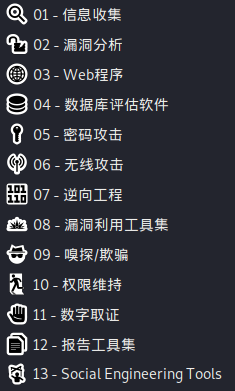

 

# 01 -  信息收集
## 1.1存活主机识别
### 1.1.1 arping
好像没啥用，先空着。
### 1.1.2 fping

Fping类似于ping，但比ping强大。Fping与ping不同的地方在于，fping可以在命令行中指定要ping的主机数量范围，也可以指定含有要ping的主机列表文件。

目标IP地址的输入方式：
```
fping IP1 IP2 IP3 ...；

fping -f filename；

fping -g IP1 IP2（IP1地址开始范围，IP2地址结束范围）；
```
### 1.1.3 hping3

hping3的功能：

防火墙测试

端口扫描

Idle扫描

文件传输

木马功能

拒绝服务攻击DDOS


这里讲讲拒绝服务攻击DDOS:

我使用 testphp.vulnweb.com 这个网站来测试 :
```
hping3 -c 10000 -d 120 -S -w 64 -p 80 --flood --rand-source testphp.vulnweb.com
```
注意不要加上:  http:// or www.否则会报错。

    -c：发送数据包的个数
    -d：每个数据包的大小
    -S：发送SYN数据包
    -w：TCP window大小
    -p：目标端口，你可以指定任意端口
    –flood：尽可能快的发送数据包
    –rand-source：使用随机的IP地址，目标机器看到一堆ip，不能定位你的实际IP；也可以使用-a或–spoof隐藏主机名

### 1.1.4 masscan

扫描用，比如扫描端口：
```
Masscan 10.11.0.0/16 -p80
```

### 1.1.5 thcping6

主要用于ipv6

## 1.2 路由分析

### 1.2.1 netdiscover

专用的二层发现工具。拥有主动和被动发现两种方式。

```
netdiscover -r 192.168.28.129/24
```

# 06 - 无线攻击
## 06.1蓝牙工具集
### 6.1.1 spooftoop

Spooftooph是一个了不起的工具，旨在自动欺骗或克隆蓝牙信息（名称，类和地址）。

您可以看这个视频学
```
https://www.youtube.com/watch?v=JmQk4Yp9bww
```
1. 首先使用终端运行hciconfig指令看interface和开关情况：DOWN。
```
hciconfig
```

如果不懂可以使用man hciconfig查看说明。

2. 终端开启。
```
hciconfig hci0 up
```


